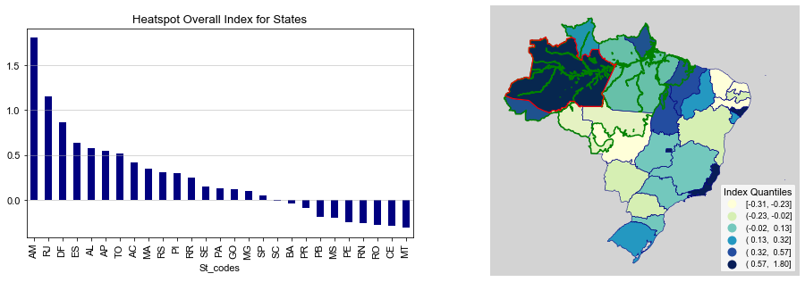
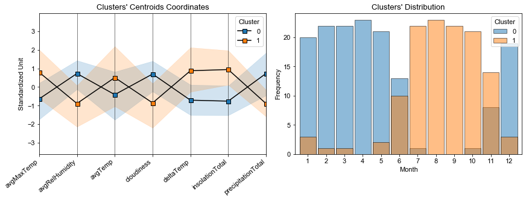
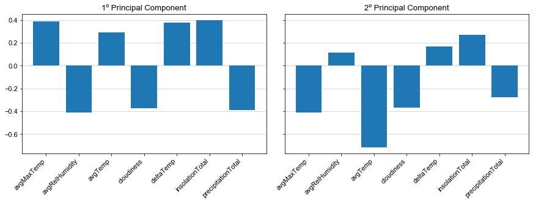
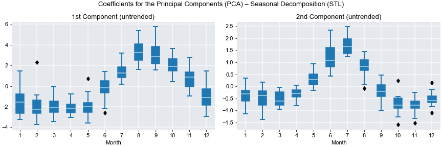
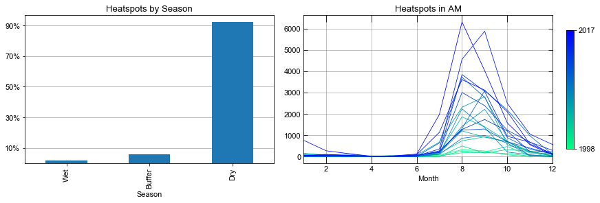
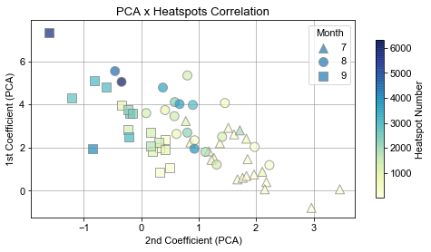
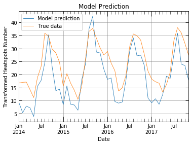

# Amazon Fires

This repository introduces a study about fires in the Amazon (Brazil) where the Amazon rainforest is found. The motivaton for this study is to address a subject of acknowledged relevancy in today's society as it relates to environmental responsibility and climate change, together with the benefits of a *data-driven* oriented perspective well common in data science.

The data supporting this study comes mainly from the satellite monitoring system which is responsible for detecting heatspots on land, a similar program of deforestation monitoring exists and its data is also used. Beyond these, weather measurements such as precipitation, temperatures, and so on, were queried from a variety of weather stations spread all over the area of interest. Most technologies and tools used in this study are available on packages as Scikit Learn, Pandas, GeoPandas, statsmodels (for statistical modelling and time series analysis) and Matplotlib. The research is organized into 3 parts, each one has its own presentation and notebook (more on the *contents* section):

1. Weather Analysis - This first part is focused on the gathering, processing and analysis of the climate data recorded on local weather stations. First the weather stations within the area of interest are filtered out followed by the selection and aggregation climate variables whose data is dense enough for further analysis. During this initial *exploratory data analysis* EDA techniques used are such as *clustering analysis*, *principal component analysis* (PCA) and decomposition, *seasonal-trend decomposition with Loess* (STL) and *Block Bootstrap* for statistical inference.

2. Heatspots Analysis - The second part of the research focuses on the data collected and distributed as heatspots countings over the Brazilian territory. Under this analysis, the distribution of the observed heatspots is studied as well as the regions (states) most affected and the impact on the Amazon basin. The heatspots number is studied with respect to its development over time and an *index* is devised to translate which areas are suffering the most from increase in heatspots number. As demonstrated, the Amazon region is the most critical under this perspective and finally results from the previous *weather analysis* together with *deforestation data* are brought in to enhance further conclusions and insights on the subject.

3. Machine Learning Modelling -  The last part of this research aims to produce a predicting model for heatspots based on climate data alone and the insights/conclusions drawn from the earlier analysis and explorations. Questions dealt with in this section refer to the transformations and tuning used in the optimization of the regression model chosen to take on the machine learning task.

  

## Table of Contents 

1. [Contents](#contents) (repository)
2. [Executive Summary](#summary)
    1. [EDA part I: Clustering](#eda1)
    2. [EDA part II: Time Series Analysis and PCA](eda2)
    3. [Analysis of Heatspots in Amazon](#heatspots_analysis)
    4. [Machine Learning: Predicting Heatspots](#ml)

3. [Final Thoughts](#final-thoughts)

 

* * *

## 1. CONTENTS (repository) 

* `01_wheather_analysis.ipynb` - *Notebook with all work performed on the first part of this research (weather analysis).*
* `02_heatspots_analisys.ipynb` - *Notebook with all work done for the second part of this research (heatspots analysis).*
* `03_meachine_learning.ipynb` - *Notebook carrying out the processing, training and evaluation of the predictive model.*
* `wheather_data.pkl` - *File containing the processed data and outcomes from the Weather Analysis.*
* `data` - *Directory where all primary data used in this research is stored.*
    * `deforestation.csv` - *Data set containing yearly incremental area of deforestation.*
    * `heatspots_states_1998-2017.csv` - *Data set of heatspots counting per state (Brazil).*
    * `biomes.json/brazil_biomes.geojson` - *geolocation of boundaries for each Brazilian state.*
    * `stations` -  *Directory containing several files, each corresponds to all data recorded in a specific weather station.*
    * `geojson` - *Directory containing .json from every Brazilian state,*
    * `misc` - *Directory contaning files of minor importance.*
* `resources` - *Directory containing the core Python modules used and developed in this project.*

## 2. SUMMARY 

The data from satellite monitoring of heatspots over the Brazilian territory is available from 1998 up to 2017. The notebook `02_heatspots_analysis.ipynb` carries out in detail the work done regarding this data. One of the conclusions was that the state **AM** (in red on the image below) is the one suffering from the highest rate in number of heatspots. Being located in the heart of the Amazon biome (in green), it has a direct parallel with the fires happenning in the rainforest.

On this graph, each state is counted for its *relative* increase in heatspots. Besides the state **AM** (in red), the few other of high index value are located on the coastline and have very low *absolute* counts of heatspots, therefore for these states, the high index value doesn't translate directly into a warning for caution and a dangerous rise in heatspots countings as in the case of the Amazon biome.

With that in mind, an analysis of the local weather is undertaken and climate data is collected from fixed local stations corresponding to the same period on which heatspots data is available. The data is a collection of several variables and they are selected in accordance with a few criteria:

* Density in the data. The specific variable must be presented without big blanks or gaps in the record.
* Consistency. Each variable recorded in each station shouldn't be very different from neighboring stations.

Under these criteria the data is aggregated in order to be representative of the entire area. This step is covered in detail in the notebook `01_wheather_analysis`. The climate variables then explored are:

| Variable Name | Description |
| --- | --- |
| AvgMaxTemp | The monthly average of the max temperatures |
| AvgTemp | The monthly average of the mean temperatures |
| avgRelHumidity | The monthly average of the relative humidity levels |
| InsolationTotal | The total number of hours of insolation in the month |
| PrecipitationTotal | The accumulated precipitation level in the month |
| cloudiness | An index measuring the blockage of sunlight |
| deltaTemp | The difference between the average max and min temperatures |
 

### 2.1. EDA part I: Clustering 

The *clustering analysis* was optimized through 2 independent approaches (elbow and silhouette methods), both supporting strongly the existence of two main clusters with distinct characteristics. The graph below on the left comprehends these 2 clusters from where the main difference between them can be drawn: generally speaking, there are *dry* months of *high temperature* and *colder cloudy-wet* months.

By looking at the distribution of such months (the so called clusters 0 and 1) it's clear that they happen consistently and regulary at certain periods of the year, with the hotter months usually between July and November, with emphasis on *August and September*. By these means, the basic idea from the clusters can be extended into the understanding of the *predominance* of two main *seasons* on the area. This concept becomes very important in this study as further analysis will improve upon that.

 

### 2.2. EDA part II: Time Series Analysis and PCA 

The *Principal Component Analysis* extracted two main *degrees of freedom* from the climate variables, which together explain nearly 90% of all the variance in the data. The *1st principal component* will present the same ideas brought forth by clustering the data, whereas the *2nd principal component* will agglutinate characteristics of both seasons. It stands out that the 2nd component will *bust strongly the `avgTemp`* variable (for negative coefficients). 

The great advantage PCA will have over the previous clustering analysis is from the study of the coefficients of these components. With this purpose, a *time series analysis* was carried out on both principal components and the main outcomes can be further ahead summarized:

* SEASONALITY

By the STL technique the time series can be decomposed into primal constituents, among them the seasonal component. In accordance with the conclusions drawn by clustering, the analysis explains that the *dry-hot*  season (1st component with positive values) will be more intense during the months *August and September*. Furthermore, during these same months the 2nd component coefficient plunges towards negative values which further enhances the characteristics of the *dry-hot season* with respect to high temperatures and lower relative humidity.

* TREND

Another *key* aspect that can be connected with the situation of heatspots and its increasing in the Amazon area is the trend found within the coefficients of the *principal component analysis*. For the 1st component there was a positive trend and for the second a trend towards negative values over time. That means the hot-dry seasons are becoming ever more intensified with higher temperatures and dryer conditions.

The above graph depicts the negative trend from the STL model and the statistical significance of that trend was obtained by applying a Block Bootstrap algorithm on the slope coefficient of the regression line.

    >>> coeff_2 Bootstrap Statistics
    >>> Confidence Level 95%
    -----------------------------------------------------------------
    E[stat]           Std.Error                  [0.025 --- 0.975]
    =================================================================
    -0.036               0.012                   -0.059    -0.0137

The same procedure was taken for the trend on the 1st principal component but it can't be stated with *confidence level of 95%* that the trend in the sample isn't null.

    >>> coeff_1 Bootstrap Statistics
    >>> Confidence Level 95%
    -----------------------------------------------------------------
    E[stat]           Std.Error                  [0.025 --- 0.975]
    =================================================================
     0.029               0.020                   -0.010     0.068

### 2.3. Analysis of Heatspots in Amazon 

With the heatspots data set in hands it is possible to investigate how the number/quantity of heatspots correlates with the already achieved findings. Thus each month in the series is categorized based on the value of its coefficient (referring to the 1st principal component). The following table summarizes this categorization task:

| Season | 1st Coefficient value |
| --- | --- |
| Dry | > 1.0 |
| Buffer | > -1.0 and < 1.0 |
| Wet | < -1.0 |

A *buffer* zone was introduced to group those months whose coefficient value isn't far enough from 0. The goal is to have a Dry-Hot and Rainy-Wet seasons clearly distincted, i.e. taking coefficients with a minimum distance between them in order to compare the heatspots that occur in each of those seasons.

The bar chart on the left clearly shows how the heatspots detections are overwhelmingly concentrated in the hot-dry season. That represents a strong evidence to the connection between the climate aspect found in the Amazon region and the occurrence of fires in the vegetation. On the right further evidence appears as it can be deduced from the graph that the heatspos are occuring with more intensity in the same months (August and September) indicated by the PCA as those of more intense temperature and dryness.

Besides, the heatspots number showing the same *seasonality* (pattern) found in the climate data, the heatspots are increasing over time *only* in that same season, which also correlates with the trend found in the time series of both coefficients. The following graph explores the correlation between the coefficients from the PCA and the yearly rise in the heatspots number.

This scatter plot pictures that when the heatspots number increases along the months July, August and September, the coefficient of the 1st principal component also increases while the 2nd principal component decreases simultaneously. The cooperation between these principal components in such way only serves to increase the temperature strongly while keeping low levels of humidity which creates allowable conditions for the appearing and spreading of fires, which is reflected in the increasing of heatspots.

This analysis is carried out in the notebook `02_heatspots_analysis.ipynb` where the *deforestation* data is also used to look for possible evidences of this increase in heatspots observed in the Amazon region. It was analysed both numerically and graphically, but no findings were observed that could connect these two phenomena.

 

### 2.4. Machine Learning Model: Predicting Heatspots 

The next step in this work was the building and evaluation of a machine learning model for predicting the number of heatspots while accounting for all insights and findings gathered during the previous analyses. The prediction is a regression task since the goal is a continuous numeric value and all preprocessing of the data is already performed in the first stages of this work.

The model will be evaluated by *forecasting* the heatspots number and comparing the model's output with the true numbers for heatspots. Therefore the data was split into two periods:
* 1998-2013: All data available during this period will be used on training and tuning the model
* 2014-2017: This data will be kept separated from the rest and later used for evaluating the final model.

The input data will be the records of the local weather stations preprocessed into a single data set with the climate variables described earlier. This input data will face a series of transformations streamlined into a pipeline to finally feed a *regularized linear model*.

For the regression task, the heatspots number are *log-transformed* and the fine adjustment of the final model is achieved by tuning its hyperparameters through *cross-validation*. These hyperparameters are adjusting the transformations the input data goes through and are summarized in the following table:

| Parameter | kind | Transformation |
| --- | --- | --- |
| add_season | boolean | Adds a feature to the data set by categorizing which season is in question |
| n_components | integer > 2 | The number of principal components to be used on the decomposition |
| degree | integer 1> | The degree of the polynomial transformations applied |
| interaction_only | boolean | Whether to consider only cross products of the features in the polynomial transformation |
| alpha | float | The regularization parameter of the regression (ridge) |

 

All specific steps taken in this stage are detailed in the notebook `03_machine_learning.ipynb`. There are still numeric aspects of the model's evaluation and the residuals produced by the model on the data used for testing. The performance of the model on the testing data is shown on the plot below.

The model can reproduce the rise and plunges of the true data. While its seems more accurate during the increase of the heatspots numbers, on its plunge, the model doesn't capture with the same accuracy the apparent *lingering effect* of the heatspots on the subsequent months after the peak.

 

## 3. FINAL THOUGHTS 

The work done in this research revealed a connection between the occurrence of heatspots and the climate aspects in the region. It was revealed through the analysis of several weather measurements that the Amazon weather has very distinct patterns and the increase of heatspots happens in parallel to the intensity of such patterns, a configuration of weather variables that produce a rather dry and hot condition in specific periods of the year.

It was also warned that over the last years, this condition may be getting gradually more intense and severe, which could be hapenning in tandem with the occurrence of heatspots, which not only happens cyclicly within a year, but also *between* years, it's shown that heatspots numbers are increasing in the Amazon region each year, in fact, the greater increase rate in Brazil, which threatens the entire Amazon biome as these heatspots are potential sources of wild fires in the vegetation.

Improvement points in this research are:
* Further data regarding the heatspots could enrich the work on both the analysis as well as on the building of the predict model. Data that could offer characteristics of the observed heatspots and/or areas where they are supposedly more frequent would be helpful for aggregating the weather mesurements into a more representative data set.
* More flexible models as those based on neural networks can be implemented in order to capture effects that would further enhance the accuracy of the predicting model. 
