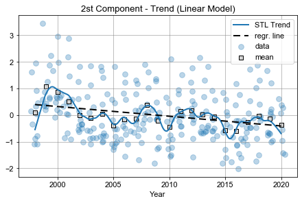

# Amazon Fires

This repository introduces a study about the fires in the amazon (Brazil) where is found the amazon rainforest. The motivaton for this study is to approach a subject of acknowledged relevancy on today's society as it relates to environmental responsability, climate change and sorts, together with the benefits of a *data-driven* oriented perspective well common in data science.

The data supporting this study comes mainly from the satellite monitoring system which is responsable for detecting heatspots on the land, a similar program of monitoring deforestation exists and its data is also used. Beyond these, wheather measurements  as precipitation, temperatures, and so on, were queried from a variety of wheather stations spread all over. Most technologies and tools used in this study are available on packages as Scikit Learn, Pandas, GeoPandas, statsmodels (for statistical modelling and time series analysis) and Matplotlib. The research is organized into 3 parts, each one has its own presentation and notebobok (more on the *contents* section):

1. Wheather Analysis - This first part is focused on the gathering, processing and analysis of the climate data recorded on local wheather stations. First the wheather stations within the area of interest are filtered out followed by the selection and aggregation of the climate variables dense enough for further analysis. During this initial *exploratory data analysis* EDA techniques used are such as *clustering analysis*, *principal component analysis* (PCA) and decomposition, *seasonal-trend decomposition with Loess* (STL) and *Block Bootstrap* for statistical inference.

2. Heatspots Analysis - The second part of the research focuses on tha data collected and distributed as heatspots counting over the brazilian territory. under this analysis it is studied the distributions of the heatspots observed, the regions (states) most affected as well as the impact on the Amazon basin. The heatspots number are studied with respect to its development over time and a *index* is devised to translate which areas are suffering from strong increase of its numbers (heatspots). As it's demonstrated, the Amazon Region is the most critical region under this perspective and finally results from the previous *wheather analysis* together with *deforestation data* are brought in to enhance further conclusions and insights on the matter.

3. Machine Learning Modelling -  The last part of this research aims to produce a predicting model for heatspots based on climate data alone and the insights/conclusions drawn from the earlier analysis and explorations. Questions dealt with in this section refers to the transformations and tunning used in the optimization of the regression model chosen to take on the machine learninig task.

## Table of Contents 
1. Contents (repository)
2. Executive Summary
    1. EDA part I: Clustering
    2. EDA part II: Time Series Analysis and PCA
    3. Analysis of Heatspots in Amazon
    4. Machine Learning: Predicting Heatspots 

3. Final Thoughts

## 1. CONTENTS (repository)

* `01_wheather_analysis.ipynb` - *Notebook with all work performed on the first part of this research (wheather analysis).*
* `02_heatspots_analisys.ipynb` - *Notebook with all work done for the second part of this research (heatspots analysis).*
* `03_meachine_learning.ipynb` - *Notebook carrying out the processing, training and evaluation of the predictive model.*
* `wheather_data.pkl` - *File containing the processed data and outcomes from the Wheather Analysis.*
* `data` - *Directory where all primary data used on this research is stored.*
    * `deforestation.csv` - *Data set containing yearly incremental area of deforestation.*
    * `heatspots_states_1998-2017.csv` - *Data set of heatspots counting per state (Brazil).*
    * `biomes.json/brazil_biomes.geojson` - *geolocation of boundaries for each brazilian state.*
    * `stations` -  *Directory containing several files, each corresponds to all data recorded in a specific wheather station.*
    * `geojson` - *Directory containing .json from every brazilian state,*
    * `misc` - *Directory contaning files of minor importance.*
* `resources` - *Directory containing the core python modules used and developed in this project.*

## 2. SUMMARY

The data from satellite monitoring of heatspots over brazilian territory is available from 1998 up to 2017. The notebook `02_heatspots_analysis.ipynb` carries out in detail the work done regarding this data. One of the conclusions was that the state **AM** (in red on the image below) is the one suffering from the highest rate in number of heatspots. Being located in the heart of the amazon biome (in green) it has a direct parallel with the forest fires happenning in the rainforest.

On this graph, each state is counted for its *relative* increase in heatspots. Besides the state **AM** (in red), the few other of high index value locate on the coastline and have very low *absolute* counts of heatspots, therefore for these states, the high index value doesn't translate directly into a caution warning for a dangerous rise in heatspots countings as in the case of the amazon biome.

With that in mind, a analysis of the local wheather is undertaken and climate data is collected from stationary local stations corresponding to the same period on which heatspots data is available. The data is a collection of several variables and they are selected in accordance with a few criteria

* Density in the data. The specific variable must be presented without big blanks or gaps in the record
* Consistency. Each variable recorded in each station shouldn't be very different from neighboring stations.

Under this criteria the data is aggregated in order to be representative of the entire area. This step is covered in detail on the notebook `01_wheather_analysis`. The climate variables then explored are:

| Variable Name | Description |
| --- | --- |
| AvgMaxTemp | The monthly average of the max temperatures |
| AvgTemp | The montly average of the mean temperatures |
| avgRelHumidity | The monthly average of the relative humidity levels |
| InsolationTotal | The total number of hours of insolation on the month |
| PrecipitationTotal | The accumulated precipitation level on the month |
| cloudiness | A index measuring the blockage of sunlight |
| deltaTemp | The difference between the average max and min temperatures |
 

### 2.1. EDA part I: Clustering

The *clustering analysis* was optimized through 2 independent approaches (elbow and silhouette methods), both supporting strongly the existence of two main clusters with distinct characteristics. The graph below on the left compreehends these 2 clusters from where the main difference between them can be drawn:
> Generally speaking, there are *dry* months of *high temperature* and *colder cloudy-wet* months.

By looking at the distribution of such months (clusters) it's clear that they happen consistently and regulary at certain periods of the year, with the hotter months usually between july and november, with emphasis on *august and september*. By these means, the basic idea from the clusters can be extended into the understanding of the predominance of two main *seasons* on the area.

 

### 2.2. EDA part II: Time Series Analysis and PCA

The *Principal Component Analysis* extracts two main *degrees of freedom* from the climate variables, which together explain nearly 90% of all the data. The *1st principal component* will present the same ideas brought forth by clustering the data, whereas the *2nd principal component* will agglutinate characteristics of both seasons. It stands out that the 2nd components will *bust strongly the `avgTemp`* variable. 

The great advantage PCA will have over the previous clustering analysis if from the study of the coefficients of these components. With this purpose, a *time series analysis* was carried out on both principal components and the main outcomes can be further ahead summarized:

* SEASONALITY

By the STL technique the time series can be decomposed into primal constituents, among them the seasonal component. In accordance with the conclusions drawn by clustering, the analysis explains that the *dry-hot*  season (1st component with positive values) will be more intense during the months *august and september*. Furthermore, during these same months the 2nd component coefficient plunges towards negative values which further enhances the characteristics of the *dry-hot season* with respect to high temperatures and lower relative humidity.

* TREND

Another *key* aspect that can be connected with the situation of heatspots and its increasing the the amazon area is the trend found within the coefficients of the *principal component analysis*. For the 1st components there was a positive trend and for the second a trend towards negative values over time. That means the hot-dry seasons are becoming ever more intensified with higher temperatures and dyer conditions.

On the above graph is depicted the negative trend from the STL model and the statistical significance of that trend was obtained by applying a Block Bootstrap algorithm on the slope coefficient of the regression line.

    >>> coeff_2 Bootstrap Statistics
    >>> Confidence Level 95%
    -----------------------------------------------------------------
    E[stat]           Std.Error                  [0.025 --- 0.975]
    =================================================================
    -0.036               0.012                   -0.059    -0.0137

The same procedure was taken for the trend on the 1st principal component but it can't be stated with *confidence level of 95%* that the trend in the sample isn't null.

    >>> coeff_1 Bootstrap Statistics
    >>> Confidence Level 95%
    -----------------------------------------------------------------
    E[stat]           Std.Error                  [0.025 --- 0.975]
    =================================================================
     0.029               0.020                   -0.010     0.068

### 2.3. Analysis of Heatspots in Amazon

With the heatspots data set in hands is possible to investigate how does the number/quantity of heatspots correlates with the already achieved findings. Thus each month in the series is categorized based on the value of its coefficient (referring to the 1st principal component). The following table summarizes this categorization task:

| Season | 1st Coefficient value |
| --- | --- |
| Dry | > 1.0 |
| Buffer | > -1.0 and < 1.0 |
| Wet | < -1.0 |

A *buffer* zone was introduced to group those months whose coefficient value isn't enough far from 0. The goal is to have a Dry-Hot and Rainy-Wet seasons clearly distincted, i.e. taking coefficients coefficients with a minimum distance between them in order to compare the heatspots that occur on each of them.

The bar chart on the left clearly shows how the heatspots detections are overwhelmingly concentrated on the hot-dry season. That represents a strong evidence to the connection between the climate aspect found in the amazon region and the occurrence of fires in the vegetation. On the right further evidence appears as it can be deduced from the graph that the heatspos are occuring with more intensity on the same months (august and september) indicated by the PCA as those of more intense temperature and dryness.

Besides, the heatspots number showing the same *seasonality* (pattern) found in the climate data, the heatspots are increasing over time *only* on that same season, which also correlates with the trend found in the time series of both coefficients. The following graph explores the correlation between the coefficients from the PCA and the yearly rise in the heatspots number.

This scatter plot pictures that when the heatspots number increase along the months july, august and september, the coefficient of the 1st principal components also increases while the 2nd principal component decreases simultaneously. The cooperation of the principal components in such way only serve to increase strongly the temperature while keeping low levels of humidity which created allowable coditions for the appearing and spreading of fires, which is reflected on the increasing of heatspots.

This analysis is carried out in the notebook `02_heatspots_analysis.ipynb` where the *deforestation* data is also used to look for possible evidences of this increase in heatspots observed in the amazon region. This was analysed both numerically and graphically, but not findings were observed that could connect these two phenomena.

 

### 2.4. Machine Learning Model: Predicting Heatspots

The next step in this work was the building and evaluation of a machine learning model for predicting the number of heatspots while accounting for all insights and findings gathered during the previous analysis. The prediction is a regression task since the goal is a continuous numeric value and all preprocessing of the data is already performed on the first stages of this work.

The model will be evaluated by *forecasting* the heatspots number and comparing the model's  output with the true values for heatspots. Therefore the data was split into two periods:
* 1998-2013: All data available during this period will be used on training and tunning the model
* 2014-2017: This data will be kept separated from the rest and later used for evaluating the final model.

The input data will be the records of the local wheather stations preprocessed into a single data set with the climate variables described earlier. This input data will face a series of transformations streamlined into a pipeline to finally feed a *regularized linear model*.

For the regression task, the heatspots number are *log-transformed* and the fine adjustment of the final model is achieved by tunning its hyperparameters through *cross-validation*. These hyperparameters are adjusting the transformations the input data goes through and are summarized in the following table:

| Parameter | kind | Transformation |
| --- | --- | --- |
| add_season | boolean | Adds a feature to the data sey by categorizing which season is in question |
| n_components | integer > 2 | The number of principal components to be used on the decomposition |
| degree | integer 1> | The degree of the polynomial transformations applied |
| interaction_only | boolean | Whether to consider only cross products of the features in the polynomial transformation |
| alpha | float | The regularization parameter of the regression (ridge) |

 

All specific steps taken in this stage are detailed in the notebook `03_machine_learning.ipynb`. There are still numeric aspects of the model's evaluation and the residuals produced by the model on the data used for testing. The performance of the model on the testing data is shown on the plot below.

The model can reproduce the rise and plunges of the true data. While its seems more accurate dyring the increase of the heatspots numbers, on its plunge, the model doens't capture with same accuracy the apparent *lingering* of the heatspots on the subsequent months afther the peak.

 

## 3. FINAL THOUGHTS

The work done in this research revealed and connection between the occurrence of heatstops and the climate aspects in the region. It was revealed through the analysis of several wheather measurements that the amazon wheather has very distinct patterns and the increase of heatspots happens in parallel to the intensity of a such patterns, a configuration of wheather variables that produce a rather dry and hot condition on specific periods of the year.

It was also warned that over the last years, this condition may be getting gradually more intense and severe, which could be hapenning in tandem with the occurrence of heatspots, which not only happens cyclicly within a year, but also *between* years. It's shown that heatspots numbers are in a graduall increase, actually, the greater increase rate in Brazil, which threathens the entrie amazon biome as these heatspots are potential sources of wild fires in the vegetation.

Improvements points in this research are:
* Further data regarding the heatspots could enrich the work on both the analysis as well as on the building of the predict model. Data such taht could offer characterísticas of the observed heatspots and/or areas where they are supposely more frequent would be helpful on aggregating the wheather mesurements into a more representative data set.
* More flexible models as those based on neural networks can be implemented in order to capture effects that would further enhance the accuracy of the predicting model. 
